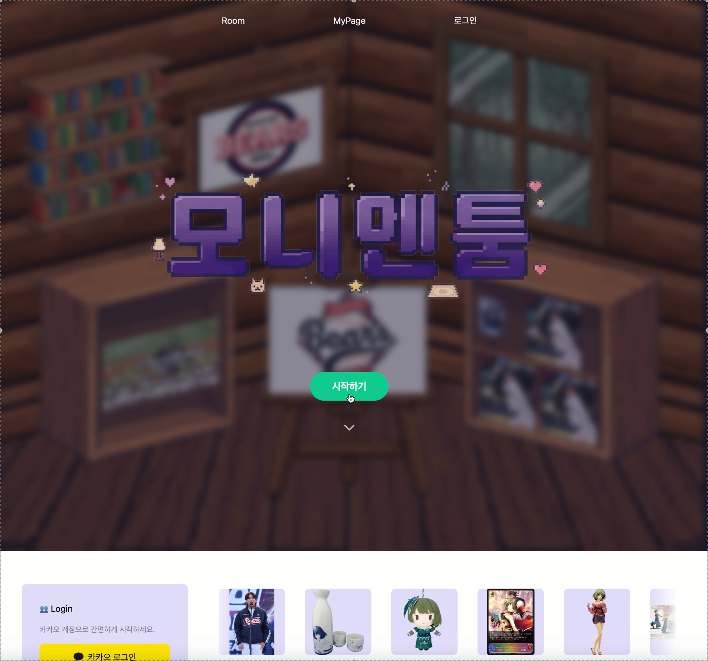
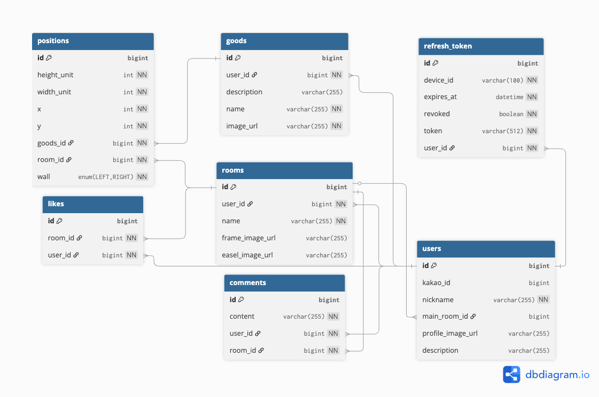

# Monimentoom Server


> 나만의 굿즈로 꾸미는 전시장 — 모니멘툼 백엔드 API 서버

[](https://openjdk.org/)
[](https://spring.io/projects/spring-boot)
[](https://www.mysql.com/)
[](https://www.docker.com/)


🔗 [서비스 바로가기](https://monimentoom-frontend.vercel.app/) &nbsp;|&nbsp;
🎬 [시연 영상](https://drive.google.com/file/d/1ouYgFqQXv8uwOCmtp8R64a07YxqDTs-r/view?usp=drive_link) &nbsp;|&nbsp;
📊 [발표자료](https://docs.google.com/presentation/d/1W-fMUOnSCB4FPwfvbDGVJWawlakjZy2gKoZtHHvEDbg/edit?slide=id.p#slide=id.p)

</div>

---

## 목차

1. [프로젝트 소개](#프로젝트-소개)
2. [주요 기능](#주요-기능)
3. [기술 스택](#기술-스택)
4. [아키텍처](#아키텍처)
5. [ERD](#erd)
6. [API 명세](#api-명세)
7. [프로젝트 구조](#프로젝트-구조)
8. [로컬 실행 방법](#로컬-실행-방법)
9. [CI/CD](#cicd)

---

## 프로젝트 소개

**모니멘툼(Monimentoom)** 은 자신이 소유한 굿즈(goods)를 가상의 방(room)에 배치하고, 다른 사람들과 공유·소통할 수 있는 서비스입니다.

- 카카오 소셜 로그인으로 간편하게 가입
- 나만의 방을 여러 개 만들고 굿즈를 자유롭게 배치
- 다른 사용자의 방을 구경하고 좋아요·댓글로 소통
- 랜덤 방 탐색 및 쇼케이스 기능으로 새로운 방 발견

<p align="center">
  
  
</p>

---

## 주요 기능

| 기능 | 설명 |
|------|------|
| **카카오 OAuth 로그인** | 카카오 인가 코드 → 기존 회원 로그인 / 신규 회원 닉네임 설정 후 가입 |
| **JWT 인증** | Access Token(헤더) + Refresh Token(HTTPOnly 쿠키), RTR(Refresh Token Rotation) 적용 |
| **방(Room) 관리** | 방 생성·수정·삭제, 메인 방 지정, 닉네임 기반 방 목록 조회 |
| **굿즈(Goods) 관리** | 인벤토리에 굿즈 추가·수정·삭제, S3 Presigned URL 이미지 업로드 |
| **배치(Position) 관리** | 방의 벽면(wall)·좌표에 굿즈 배치, 수정, 제거 |
| **좋아요(Like)** | 방 좋아요 추가/취소, 내가 좋아요한 방 목록 조회 |
| **댓글(Comment)** | 방에 댓글 작성·수정·삭제, 커서 기반 페이지네이션 |
| **랜덤 탐색** | 랜덤 메인 방 조회, 배치된 굿즈 랜덤 쇼케이스 |
| **이미지 업로드** | AWS S3 Presigned URL을 통한 클라이언트 직접 업로드 (굿즈·프로필·프레임·이젤) |

---

## 기술 스택

### Backend
| 분류 | 기술 |
|------|------|
| Language | Java 17 |
| Framework | Spring Boot 3.3.9 |
| Security | Spring Security, JWT (jjwt 0.11.5) |
| ORM | Spring Data JPA (Hibernate) |
| DB Migration | Flyway |
| API Docs | SpringDoc OpenAPI (Swagger UI) |
| HTTP Client | Spring Cloud OpenFeign |
| Validation | Spring Validation (Jakarta) |

### Infrastructure
| 분류 | 기술 |
|------|------|
| Database | MySQL 8.0 |
| Storage | AWS S3 (SDK v2) |
| Container | Docker, Docker Compose |
| Reverse Proxy | Nginx |
| CI/CD | GitLab CI/CD |
| Deploy | Blue-Green 무중단 배포 (EC2) |

---

## 아키텍처

<p align="center">
  
  
</p>


```
[클라이언트]
    │
    ▼ HTTPS
[Nginx] ──────────────────────────────────────────
    │                                             │
    ▼ HTTP                                        │
[Spring Boot App]  ──── AWS S3 (이미지 저장)      │
    │                                             │
    ▼                                             │
[MySQL 8.0]                                       │
                                                  │
[Blue-Green 배포] app-blue:8080 / app-green:8081 ─┘
```

- **Blue-Green 무중단 배포**: Nginx 업스트림을 `app-blue` ↔ `app-green` 간 전환하여 다운타임 없이 배포
- **Stateless 인증**: 세션 없이 JWT로 인증, Refresh Token은 RDB에 저장하고 매일 03:00에 만료·폐기 토큰 정리

---

## ERD



주요 테이블 관계:
- `users` ← 1:N → `rooms` (한 유저는 여러 방 보유)
- `users` ← 1:N → `goods` (한 유저는 여러 굿즈 보유)
- `rooms` ← 1:N → `positions` ← N:1 → `goods` (굿즈를 방에 배치)
- `users` ← 1:N → `likes` → N:1 → `rooms`
- `rooms` ← 1:N → `comments` → N:1 → `users`
- `users`.`main_room_id` → `rooms` (대표 방)

---

## API 명세

서버 실행 후 Swagger UI에서 전체 API를 확인할 수 있습니다.

```
http://localhost:8080/swagger-ui/index.html
```

### 애플리케이션 다이어그램


### 주요 엔드포인트 요약

#### 인증 (OAuth / Auth)
| Method | URL | 설명 | 인증 필요 |
|--------|-----|------|-----------|
| POST | `/oauth/kakao` | 카카오 로그인 (인가 코드 교환) | ❌ |
| POST | `/oauth/kakao/signup` | 카카오 신규 회원가입 (닉네임 설정) | ❌ |
| POST | `/auth/refresh` | Access Token 갱신 | ❌ (쿠키) |
| POST | `/auth/logout` | 로그아웃 | ✅ |

#### 방 (Rooms)
| Method | URL | 설명 | 인증 필요 |
|--------|-----|------|-----------|
| POST | `/rooms` | 방 생성 | ✅ |
| GET | `/rooms?nickname={nickname}` | 닉네임의 방 목록 조회 | ❌ |
| GET | `/rooms/random` | 랜덤 메인 방 조회 | ❌ |
| GET | `/rooms/showcase?size={n}` | 굿즈 랜덤 쇼케이스 | ❌ |
| GET | `/rooms/{nickname}/main` | 닉네임의 메인 방 조회 | ❌ |
| GET | `/rooms/{roomId}` | 방 조회 (굿즈 배치 포함) | ❌ |
| GET | `/rooms/{roomId}/detail` | 방 상세 조회 (주인 정보 + 댓글) | ❌ |
| PATCH | `/rooms/{roomId}` | 방 정보 수정 | ✅ |
| DELETE | `/rooms/{roomId}/positions` | 방 배치 초기화 | ✅ |
| DELETE | `/rooms/{roomId}` | 방 삭제 | ✅ |

#### 굿즈 (Goods)
| Method | URL | 설명 | 인증 필요 |
|--------|-----|------|-----------|
| GET | `/goods` | 내 굿즈 목록 조회 | ✅ |
| POST | `/goods` | 굿즈 추가 | ✅ |
| PATCH | `/goods/{goodsId}` | 굿즈 수정 | ✅ |
| DELETE | `/goods/{goodsId}` | 굿즈 삭제 | ✅ |

#### 배치 (Position)
| Method | URL | 설명 | 인증 필요 |
|--------|-----|------|-----------|
| POST | `/position` | 굿즈 배치 | ✅ |
| PATCH | `/position/{id}` | 배치 수정 | ✅ |
| DELETE | `/position/{id}` | 배치 제거 | ✅ |

#### 좋아요 (Likes)
| Method | URL | 설명 | 인증 필요 |
|--------|-----|------|-----------|
| GET | `/likes/{roomId}` | 방 좋아요 수 조회 | ✅ |
| GET | `/likes/me` | 내가 좋아요한 방 목록 | ✅ |
| POST | `/likes/{roomId}` | 좋아요 추가 | ✅ |
| DELETE | `/likes/{roomId}` | 좋아요 취소 | ✅ |

#### 댓글 (Comments)
| Method | URL | 설명 | 인증 필요 |
|--------|-----|------|-----------|
| POST | `/comments` | 댓글 작성 | ✅ |
| GET | `/comments/{roomId}/scroll` | 댓글 커서 페이지네이션 조회 | ❌ |
| PATCH | `/comments/{id}` | 댓글 수정 | ✅ |
| DELETE | `/comments/{id}` | 댓글 삭제 | ✅ |

#### 유저 (Users)
| Method | URL | 설명 | 인증 필요 |
|--------|-----|------|-----------|
| GET | `/users/profile/{id}` | 유저 프로필 조회 | ❌ |
| PATCH | `/users/profile/me` | 내 프로필 수정 | ✅ |
| PATCH | `/users/main-room/{roomId}` | 메인 방 변경 | ✅ |
| DELETE | `/users/{id}` | 회원 탈퇴 | ✅ |

#### S3 Presigned URL
| Method | URL | 설명 | 인증 필요 |
|--------|-----|------|-----------|
| GET | `/s3/presigned-url/goods?fileName={name}` | 굿즈 이미지 업로드용 URL 발급 | ✅ |
| GET | `/s3/presigned-url/profile?fileName={name}` | 프로필 이미지 업로드용 URL 발급 | ✅ |
| GET | `/s3/presigned-url/frame?fileName={name}` | 프레임 이미지 업로드용 URL 발급 | ✅ |
| GET | `/s3/presigned-url/easel?fileName={name}` | 이젤 이미지 업로드용 URL 발급 | ✅ |

---

## 프로젝트 구조

```
src/main/java/com/example/monimentoom/
├── domain/
│   ├── comments/        # 댓글 (Comment)
│   ├── goods/           # 굿즈 인벤토리 (Goods)
│   ├── like/            # 좋아요 (Like)
│   ├── position/        # 굿즈 배치 (Position)
│   ├── room/            # 방 (Room)
│   └── user/            # 유저 (User)
├── global/
│   ├── auth/            # JWT 인증 필터, AuthService, RefreshToken
│   ├── oauth/           # 카카오 OAuth (OpenFeign 클라이언트)
│   ├── s3/              # AWS S3 Presigned URL 발급·삭제
│   └── config/          # 비동기·스케줄러 설정
├── config/              # Security, Web, Feign 설정
└── exception/           # 전역 예외 처리, ErrorCode
```

---

## 로컬 실행 방법

### 사전 요구사항

- Java 17
- Docker & Docker Compose

### 환경 변수 설정

`src/main/resources/application.yaml` 파일을 생성하고 아래 항목을 설정합니다.

```yaml
spring:
  datasource:
    url: jdbc:mysql://localhost:3306/monimentoom
    username: {DB_USERNAME}
    password: {DB_PASSWORD}
  jpa:
    hibernate:
      ddl-auto: validate

jwt:
  secret: {JWT_SECRET_KEY}

kakao:
  client-id: {KAKAO_REST_API_KEY}
  redirect-uri: {KAKAO_REDIRECT_URI}

cloud:
  aws:
    s3:
      bucket: {S3_BUCKET_NAME}
    credentials:
      access-key: {AWS_ACCESS_KEY}
      secret-key: {AWS_SECRET_KEY}
    region:
      static: ap-northeast-2
```
### 실행
```bash
# 1. 빌드 (테스트 제외)
./gradlew clean build -x test

# 2. 실행
java -jar build/libs/monimentoom-0.0.1-SNAPSHOT.jar
```

### 로컬 Docker Compose (Nginx + 앱)

```bash
docker-compose -f docker-compose.local.yaml up -d
```

> 로컬 HTTPS 환경이 필요한 경우 `nginx.local.conf`를 참고하여 로컬 SSL 인증서(`localhost.crt`, `localhost.key`)를 준비하세요.
---

## CI/CD

GitLab CI/CD 파이프라인 3단계로 구성됩니다.

```
MR/main 브랜치 push
        │
        ▼
┌──────────────┐
│   test       │  Gradle 테스트 (H2 인메모리 DB)
└──────┬───────┘
       │ main 브랜치만
       ▼
┌──────────────┐
│   build      │  Docker 이미지 빌드 → GitLab Registry push
└──────┬───────┘
       │
       ▼
┌──────────────┐
│   deploy     │  EC2에 SSH 접속 → Blue-Green 무중단 배포
└──────────────┘
```

### Blue-Green 무중단 배포 흐름

1. 최신 Docker 이미지 pull (비활성 컨테이너)
2. 비활성 컨테이너 기동
3. `/actuator/health` 헬스체크 통과 확인
4. Nginx 업스트림을 신규 컨테이너로 전환
5. 기존 컨테이너 종료